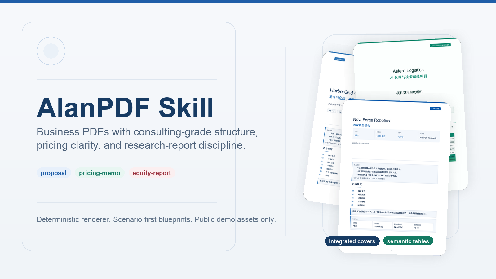

<div align="center">
  <h1>AlanPDF Skill</h1>
  <p>Markdown-to-PDF skill and deterministic renderer for consulting proposals, pricing memos, whitepapers, quotations, and equity research reports.</p>
</div>

<p align="center">
  <a href="https://github.com/BitmanAlan/alanpdf-skill">GitHub</a> ·
  <a href="#showcase">Showcase</a> ·
  <a href="#quick-start">Quick Start</a> ·
  <a href="#install-as-a-codex-skill">Install as a Codex Skill</a>
</p>



AlanPDF Skill is a Codex skill and Markdown-to-PDF renderer for business documents where layout quality matters as much as the words. It is built for consulting-style proposals, whitepapers, pricing and quotation documents, project fee memos, and equity-style research reports that need institutional structure instead of generic Markdown export styling.

Instead of treating every file like a theme problem, AlanPDF starts with document intent. You choose a blueprint such as `proposal`, `pricing-memo`, or `equity-report`, then layer a style preset on top. The result is a PDF that reads like a finished business deliverable, not a plain markdown-to-pdf conversion artifact.

## Use AlanPDF When You Need To

- Convert Markdown to PDF for client-ready proposals and strategy documents.
- Generate pricing memos, quotations, and fee breakdown PDFs with clean numeric tables.
- Produce Chinese and bilingual business PDFs with stronger typography and spacing.
- Render equity research notes, coverage initiations, and market update reports.
- Install a reusable Codex skill for business-grade PDF generation with deterministic output.

## Why AlanPDF

Most Markdown PDF tools are good at generic reports. They break down when the document needs to feel commercial, client-ready, bilingual, or sell-side.

AlanPDF is designed to solve that gap:

- Blueprint-first rendering: document structure comes before colors.
- Business table handling: pricing, forecast, valuation, and comparison tables get semantic treatment.
- CJK and Latin support: Chinese and English can live in the same document cleanly.
- Integrated first pages: proposals, quotations, and research notes start like real deliverables, not like plain exports.
- Deterministic output: same input, same result, which makes iteration practical.

## Keywords And Search Intent

People usually find this repository when they are looking for one of these jobs:

- markdown to pdf for proposals
- markdown to pdf for pricing memo or quotation
- business pdf generator for Chinese documents
- consulting proposal pdf template from markdown
- equity research report pdf generator
- Codex skill for reportlab PDF generation

## Designed For

| Document Type | Where It Fits | What It Optimizes For |
| --- | --- | --- |
| `proposal` | strategy plans, whitepapers, product plans, solution docs | integrated cover, clean section hierarchy, executive readability |
| `pricing-memo` | quotations, fee memos, service package breakdowns | numeric clarity, totals emphasis, recommendation rows |
| `equity-report` | research notes, coverage initiations, market updates | rating box, forecast tables, risk separation, institutional tone |

## Showcase

All preview materials in this repository are synthetic public demos. No client information is used.

| Proposal | Pricing Memo | Equity Report |
| --- | --- | --- |
| [](examples/proposal/harborgrid-platform.pdf) | [](examples/pricing-memo/astera-ai-enablement.pdf) | [](examples/equity-report/novaforge-robotics.pdf) |
| [HarborGrid Operations Cloud](examples/proposal/harborgrid-platform.pdf) | [Astera Logistics Pricing Memo](examples/pricing-memo/astera-ai-enablement.pdf) | [NovaForge Robotics Coverage](examples/equity-report/novaforge-robotics.pdf) |

## What Makes It Feel Like A Product

AlanPDF does not just restyle paragraphs. It understands common business-document patterns and renders them with purpose.

| Capability | What It Means In Practice |
| --- | --- |
| Semantic tables | Fee summaries, forecast tables, peer comps, and recommendation rows render with the right visual emphasis |
| Semantic blocks | `thesis`, `rating-box`, `risk-disclosure`, and `disclaimer` become visually distinct artifacts |
| Scenario presets | Blueprints and style presets reduce art-direction work for recurring document types |
| Integrated navigation | Long documents can surface compact page-one navigation instead of default TOC pages |
| Business typography | Headings, metadata chips, body rhythm, and page furniture feel closer to consulting or broker output |

## How It Works

1. Write Markdown with frontmatter and light semantic markers.
2. Pick the blueprint that matches the document's job.
3. Apply a style preset such as `navy-consulting` or `broker-classic`.
4. Render with `scripts/alanpdf.py`.
5. Iterate on content, not layout firefighting.

Example semantic table marker:

```md
<!-- alanpdf: table=pricing -->
| 项目 | 周期 | 金额 |
| --- | --- | ---: |
| 数据底座梳理 | 2周 | 48,000 |
| 合计 | 2周 | 48,000 |
```

Example semantic block:

```md
<!-- alanpdf: block=thesis -->
1. 管理层将重心从定制项目转向标准化平台收入。
2. 海外渠道恢复带来利润率修复空间。
```

## Quick Start

Install dependencies:

```bash
python3 -m pip install -r requirements.txt
```

Render one of the bundled examples:

```bash
python3 scripts/alanpdf.py \
  --input examples/proposal/harborgrid-platform.md \
  --output examples/proposal/harborgrid-platform.pdf
```

The example Markdown files already include frontmatter such as `blueprint`, `style`, and cover metadata, so the shortest render command only needs `--input` and `--output`.

Render all public showcase files:

```bash
bash scripts/render_examples.sh
```

## Install As A Codex Skill

HTTPS:

```bash
git clone https://github.com/BitmanAlan/alanpdf-skill.git ~/.codex/skills/alanpdf
```

SSH:

```bash
git clone git@github.com:BitmanAlan/alanpdf-skill.git ~/.codex/skills/alanpdf
```

The skill entrypoint is [`SKILL.md`](SKILL.md). UI metadata lives in [`agents/openai.yaml`](agents/openai.yaml).

## Why This Repository Exists

This repository exists for teams and solo operators who already write in Markdown but need the final output to look like a proposal, fee memo, board-facing whitepaper, or broker-style report. The goal is not generic document export. The goal is repeatable, business-grade PDF output with better tables, better covers, and better first-page structure.

## Style Presets

`navy-consulting`, `emerald-executive`, `charcoal-minimal`, `warm-whitepaper`, `broker-classic`, `sellside-slate`, `ir-clean`

The blueprint decides the document grammar. The style preset decides the visual mood.

## Repository Layout

```text
.
├── SKILL.md
├── agents/openai.yaml
├── references/
├── scripts/
│   ├── alanpdf.py
│   └── render_examples.sh
├── examples/
│   ├── proposal/
│   ├── pricing-memo/
│   └── equity-report/
└── assets/previews/
```

## Privacy Note

This public repository intentionally avoids real customer materials. All company names, metrics, prices, and research numbers used in examples are fictional showcase content drafted for GitHub presentation.

## License

MIT. See [`LICENSE`](LICENSE).
