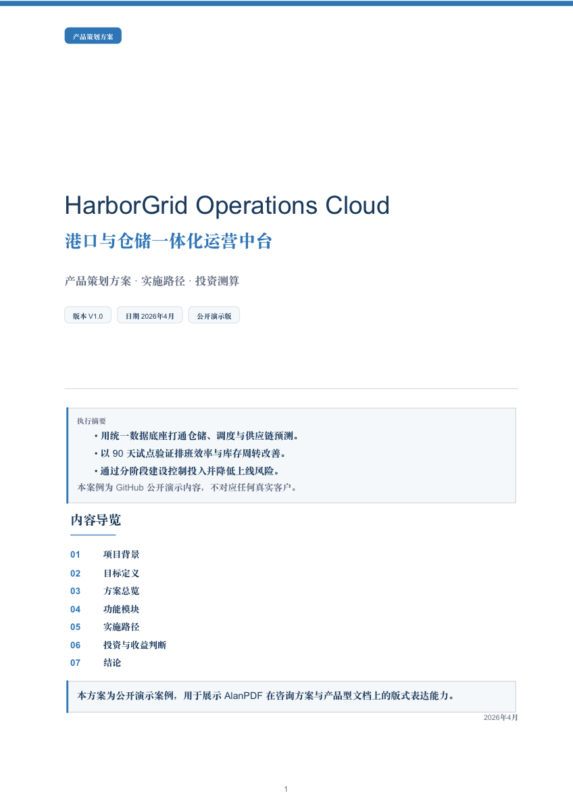
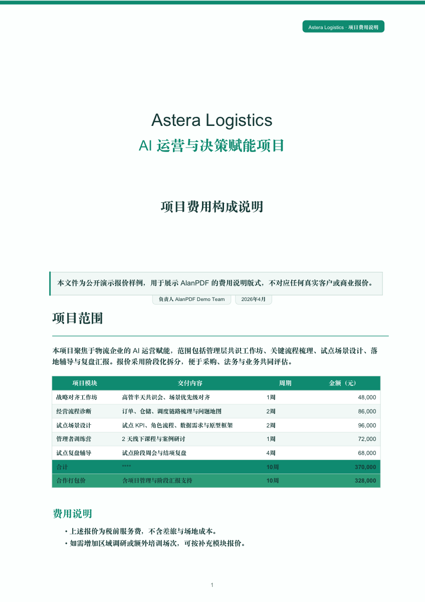
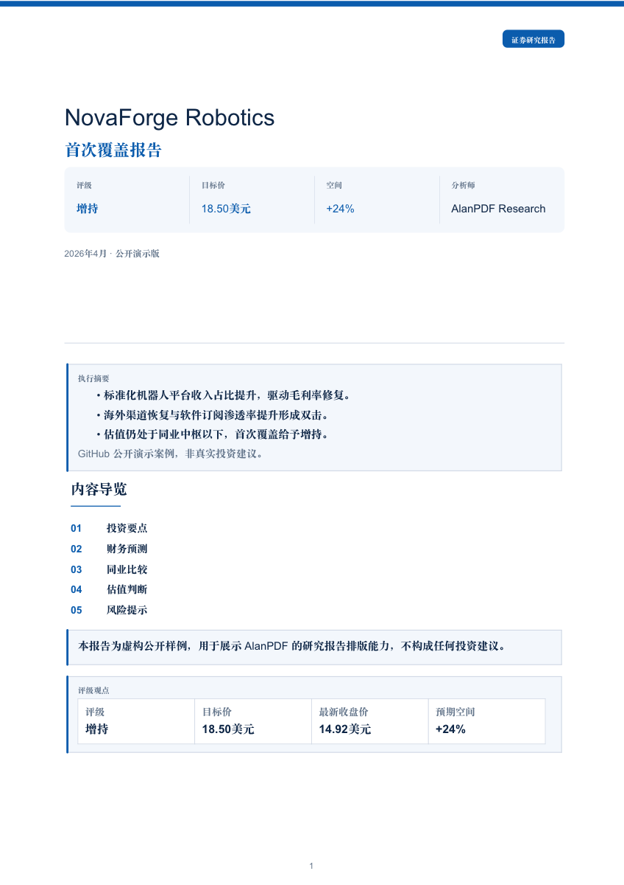

# AlanPDF Skill

Business-grade PDF generation from Markdown, tuned for proposals, pricing memos, and equity-style research reports.

AlanPDF Skill is a Codex skill plus a deterministic renderer. It takes structured Markdown and produces polished PDFs with integrated cover layouts, business-friendly tables, semantic callout blocks, CJK and Latin typography, and scenario-specific visual blueprints.

## Preview

All preview documents in this repository are fictional demo materials created for public showcase use only.

| Proposal | Pricing Memo | Equity Report |
| --- | --- | --- |
| [](examples/proposal/harborgrid-platform.pdf) | [](examples/pricing-memo/astera-ai-enablement.pdf) | [](examples/equity-report/novaforge-robotics.pdf) |
| [HarborGrid Operations Cloud](examples/proposal/harborgrid-platform.pdf) | [Astera Logistics Pricing Memo](examples/pricing-memo/astera-ai-enablement.pdf) | [NovaForge Robotics Coverage](examples/equity-report/novaforge-robotics.pdf) |

## What It Does

- Converts Markdown into presentation-quality A4 or Letter PDFs.
- Uses blueprint-first document grammar instead of generic theme-only rendering.
- Handles Chinese and English text in the same document.
- Styles pricing, comparison, valuation, forecast, and peer-comparison tables with semantic cues.
- Supports semantic blocks such as `thesis`, `rating-box`, `risk-disclosure`, and `disclaimer`.
- Produces integrated first pages suited to consulting proposals and broker-style research notes.

## Blueprints

| Blueprint | Best For | Typical Output |
| --- | --- | --- |
| `proposal` | strategy decks, whitepapers, solution plans | integrated cover + section-led business narrative |
| `pricing-memo` | quotations, fee breakdowns, service packages | pricing-first layout with numeric emphasis |
| `equity-report` | sell-side style notes, investment updates, coverage initiations | research cover, rating box, forecasts, risks |

## Style Presets

`navy-consulting`, `emerald-executive`, `charcoal-minimal`, `warm-whitepaper`, `broker-classic`, `sellside-slate`, `ir-clean`

## Quick Start

```bash
python3 -m pip install -r requirements.txt
python3 scripts/alanpdf.py \
  --input examples/proposal/harborgrid-platform.md \
  --output examples/proposal/harborgrid-platform.pdf
```

The example Markdown files already include frontmatter such as `blueprint`, `style`, and cover metadata, so the shortest render command only needs `--input` and `--output`.

To regenerate all public showcase PDFs:

```bash
bash scripts/render_examples.sh
```

## Install As A Codex Skill

Clone this repository directly into your Codex skills directory:

```bash
git clone https://github.com/BitmanAlan/alanpdf-skill.git ~/.codex/skills/alanpdf
```

If you prefer SSH:

```bash
git clone git@github.com:BitmanAlan/alanpdf-skill.git ~/.codex/skills/alanpdf
```

The skill entrypoint is [`SKILL.md`](SKILL.md). UI metadata lives in [`agents/openai.yaml`](agents/openai.yaml).

## Authoring Pattern

AlanPDF works best when the Markdown carries semantic intent instead of purely visual intent.

Use table markers:

```md
<!-- alanpdf: table=pricing -->
| 项目 | 周期 | 金额 |
| --- | --- | ---: |
| 数据底座梳理 | 2周 | 48,000 |
```

Use semantic blocks:

```md
<!-- alanpdf: block=thesis -->
1. 管理层将重心从定制项目转向标准化平台收入。
2. 海外渠道恢复带来利润率修复空间。
```

## Repository Layout

```text
.
├── SKILL.md
├── agents/openai.yaml
├── references/
├── scripts/
│   ├── alanpdf.py
│   └── render_examples.sh
├── examples/
│   ├── proposal/
│   ├── pricing-memo/
│   └── equity-report/
└── assets/previews/
```

## Privacy Note

This public repository intentionally avoids real customer materials. All company names, metrics, pricing figures, and research cases used in examples are synthetic demo content drafted for GitHub presentation.

## License

MIT. See [`LICENSE`](LICENSE).
